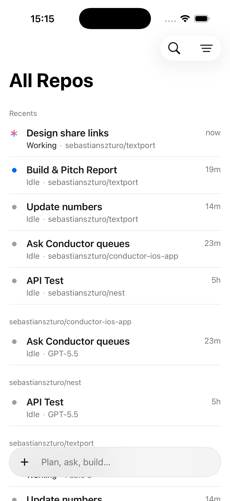
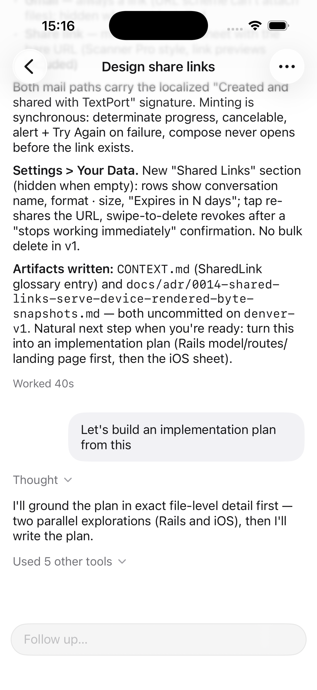
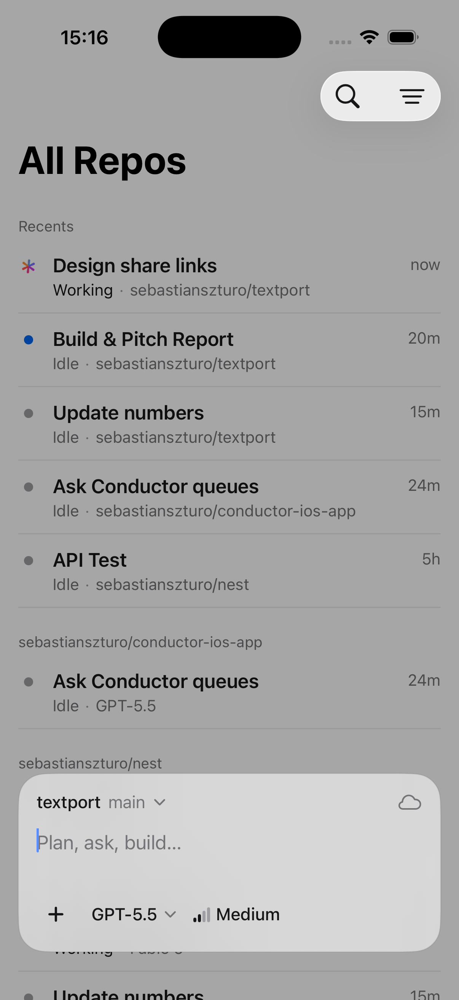
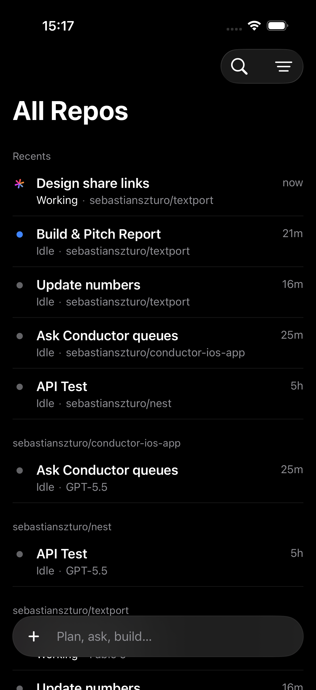
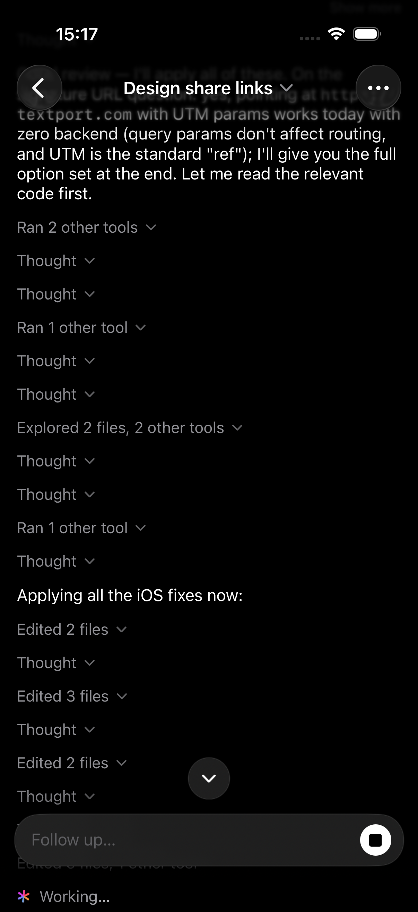

# Conduit

A native iOS client for [Conductor](https://conductor.build) cloud workspaces — kick off coding agents from your phone, watch them work in real time, and keep every repo's sessions one tap away.

Built with SwiftUI for iOS 26, in the spirit of the Cursor mobile app.

## Screenshots

| Home | Session | New session |
| --- | --- | --- |
|  |  |  |

| Dark mode | Live streaming |
| --- | --- |
|  |  |

## Features

- **Workspaces by repo** — all your Conductor workspaces grouped by project, with a Recents section ranked by real activity (working sessions first, then unread)
- **Live transcripts** — agent output streams in with markdown rendering (headings, code blocks, lists, quotes), collapsible thought/tool summaries, turn-based spacing, and time markers between distant turns
- **Chat-grade scrolling** — opens pinned to the newest message, stays pinned while streaming, never hijacks your position when you scroll up; jump-to-bottom pill with a new-activity dot
- **Start work from anywhere** — create a workspace + session from the home composer: pick repo, branch, model, and thinking level (defaults to GPT-5.5 · Medium)
- **Reply queues** — follow-ups sent while the agent is working are queued and shown inline; cancel a running turn from the composer
- **Unread & working indicators** — blue dot for unseen activity, animated working icon for sessions currently running
- **Fast cold starts** — stale-while-revalidate JSON cache for the home list and session transcripts; a previously opened session renders instantly from disk and resumes polling from its cached offset
- **Quality-of-life** — swipe-to-archive, pinned repos, archived workspaces hidden behind an explicit filter, session switcher in the title bar, automatic session titles, light & dark mode

## Requirements

- Xcode 26.2+
- iOS 26.2+ (simulator or device)
- A [Conductor](https://conductor.build) account and API key

## Getting started

1. Open `Conduit/Conduit.xcodeproj` in Xcode.
2. Build and run the `Conduit` scheme.
3. On first launch, open **Settings** and paste your Conductor API key (`sk_…`). The key is stored in the Keychain — never in source or UserDefaults.

## Architecture

```
Conduit/Conduit/
├── API/            ConductorAPI + ConductorClient — typed v0 REST client
├── Models/         Codable API models, transcript normalization
├── Services/       HomeStore, SessionStore, ResponseCache, ActivityLedger, AppSettings
├── Theme/          Adaptive light/dark design tokens
└── Views/          Home, Session, Composer, shared components
```

A few implementation notes:

- **Polling, not sockets.** The Conductor v0 API has no push channel; `SessionStore` polls messages on a 2 s cadence while the agent is working and 6 s while idle, resuming from a message offset so transcripts are append-only.
- **Two agent event families.** Message payloads arrive as either Claude stream-JSON events or Codex thread events; `TranscriptBuilder` normalizes both into one transcript model.
- **Activity you can trust.** Server `status.updatedAt` timestamps reflect row writes (bulk infra updates stamp cohorts identically), so recency ranking uses an `ActivityLedger` fed only by trustworthy signals: newest cached message time and observed working status.
- **Bounded transcript window.** Long sessions render the newest 150 rows in a plain `VStack` (lazy stacks break bottom-anchoring on large one-shot cache hydrations) with a "Show earlier messages" expander.
